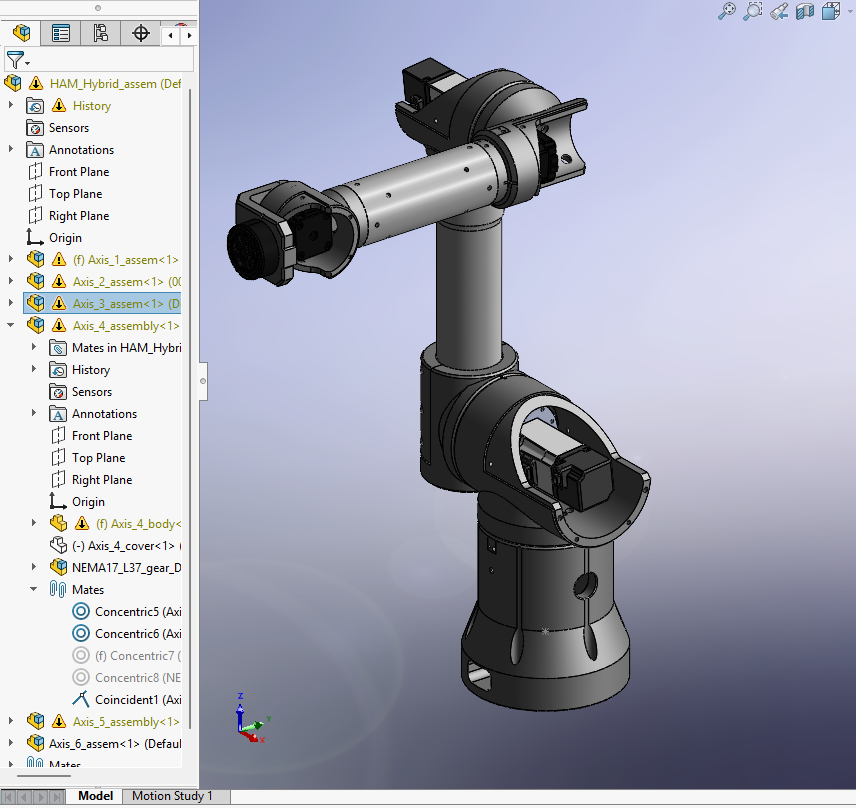
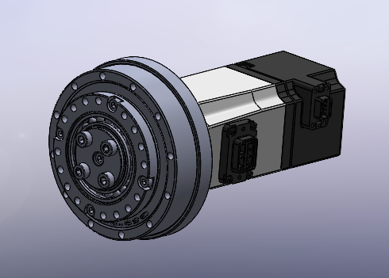
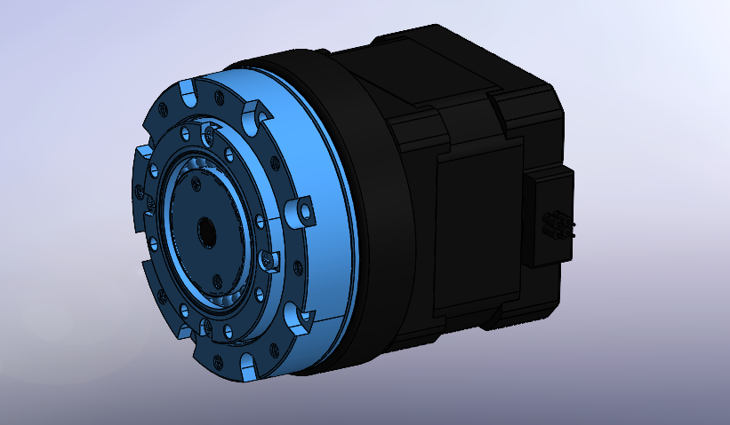
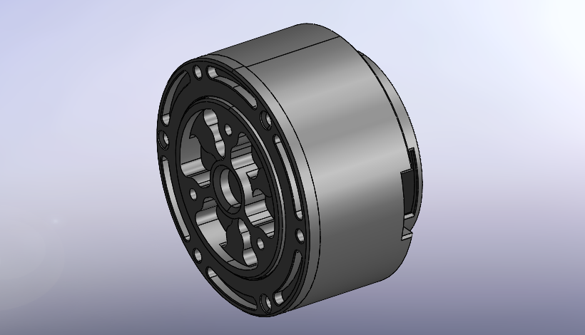

# HexaArm Hybrid: Mixed-Actuation Validation Platform

#### Compact robotic platform used to validate controller architecture, mixed motor configurations, and software workflows while HexaArm Medium is still in development.

    
    
    

 

  

 

  

---

## Overview

HexaArm Hybrid is a compact multi-axis robotic platform developed as a practical validation robot during the ongoing development of HexaArm Medium.

Instead of waiting for the Medium platform to be fully completed before testing the controller, actuator integration, and software workflows, this robot is used as an intermediate real-hardware testbed. It combines three different motor types in one kinematic chain and makes it possible to evaluate control, communication, integration, and mechanical layout decisions on a working system.

The platform is implemented in a compact format similar in scale to a mini robot, while remaining flexible enough to support mechanical customization. Its working envelope can be adjusted by changing the link lengths, which allows the same architecture to be evaluated with different proportions depending on the intended task.

This repository documents the hybrid platform as an engineering validation system rather than as a fixed final product.

---

## Why This Platform Exists

HexaArm Hybrid was created to keep development moving while HexaArm Medium is still being refined.

Its role is to reduce integration risk and shorten iteration cycles by making it possible to work on the following areas earlier in the process:

- controller bring-up on a real multi-axis robot
- EtherCAT servo integration on the main axes
- mixed-actuation control in one system
- comparison of actuator strategies by axis
- software tooling and configuration workflows
- motion testing, debugging, and tuning
- validation of architecture choices before scaling further

In practice, this means that important parts of the Medium direction can be tested on real hardware without waiting for the larger system to be finalized.

---

## Technical Architecture

| Category | Description |
| :--- | :--- |
| **Robot Type** | Hybrid validation manipulator |
| **Axis Count** | 6-DOF |
| **Primary Purpose** | Validation of controller architecture, actuator integration, and software workflows |
| **Axes 1–3** | 100 W servo motors over EtherCAT |
| **Axes 4–5** | Stepper motors with MKS drivers |
| **Axis 6** | Pancake BLDC motor |
| **Mechanical Format** | Compact robot with scalable reach through link-length customization |
| **Control Stack** | HexaCore |
| **Operator Layer** | HexaStudio |
| **Configuration Tooling** | Dedicated motor configurator |
| **CAD / Modeling** | Mechanical CAD and MATLAB-based modeling workflow |

---

## Actuation Architecture

One of the main purposes of this platform is to support mixed-actuation experiments in a single robot.

  <table>
    <tr>
      <td align="center" width="33%">
          
        <b>Axes 1–3</b> 
        100 W servo motors
      </td>
      <td align="center" width="33%">
          
        <b>Axes 4–5</b> 
        Stepper motors with MKS drivers
      </td>
      <td align="center" width="33%">
          
        <b>Axis 6</b> 
        Pancake BLDC motor
      </td>
    </tr>
  </table>

### Axes 1–3

The first three axes use **100 W servo motors over EtherCAT**.

These axes are the closest to the HexaArm Medium direction and are used to validate:

- servo-based axis control
- EtherCAT integration
- controller interaction with higher-performance servo hardware
- tuning and response of the main load-bearing joints
- software behavior under a servo-driven architecture

### Axes 4–5

Axes 4 and 5 use **stepper motors with MKS drivers**.

These axes are used to:

- evaluate a simpler actuator approach on selected joints
- compare servo and stepper behavior in one robot
- keep part of the system more accessible and easier to iterate on
- explore tradeoffs between complexity, cost, and performance by axis

### Axis 6

Axis 6 uses a **pancake BLDC motor**.

This axis is used to explore:

- compact end-axis packaging
- alternative actuator formats for wrist or tool-side integration
- integration of a different motor type into the same controller and software environment
- mixed-axis control under one shared stack

This combination makes the platform useful as a practical validation tool for motor selection and architecture decisions, not only as a demonstration robot.

---

## Mechanical Format and Scaling

HexaArm Hybrid is built in a compact format to keep manufacturing, assembly, transport, and bench testing practical.

At the same time, the platform is intentionally configurable. The reach can be changed by adjusting the link lengths, which allows the same core concept to be tested with different working envelopes and mechanical proportions.

This makes the robot useful for:

- controller and software validation in a compact footprint
- evaluation of different mechanical proportions
- early workspace and layout studies
- actuator integration without committing immediately to a larger structure
- faster hardware iteration during development

The result is a robot that is small enough to remain practical during development while still being relevant to a larger platform direction.

---

## Software Workflow

HexaArm Hybrid is not only a hardware platform. It is also used as a software validation target.

### Motor Configurator

A dedicated **motor configurator** has been developed for the platform.

Its purpose is to support motor-related setup and configuration tasks while working with different actuator types and drive strategies in one system. This is especially important on a mixed-actuation robot, where a clean configuration workflow reduces friction during bring-up and experimentation.

### HexaStudio

The intended operator-facing environment for the platform is **HexaStudio**.

HexaStudio is used as the main interface layer for interaction with the robot and is intended to support setup, control, and general operation workflows.

### HexaCore

The robot is designed around the **HexaCore** controller.

HexaCore provides the main controller-side foundation for the hybrid architecture and is used to keep the control workflow aligned with the broader HexaArm development direction.

Together, the motor configurator, HexaStudio, and HexaCore form the software side of the validation environment used on this platform.

---

## What This Robot Is Used For

### Controller Validation

The robot is used to validate HexaCore on a real multi-axis machine before the Medium platform is finalized. This includes communication, startup behavior, axis coordination, motion commands, and integration across different motor technologies.

### Servo Integration

Because the first three axes use EtherCAT-connected 100 W servos, the platform serves as a practical environment for working with the servo architecture planned for the Medium direction.

### Mixed-Actuator Experiments

The robot allows servo motors, steppers, and a BLDC motor to operate within one shared system. This is useful when evaluating which actuator type is appropriate for each axis and how those choices affect integration, complexity, packaging, and behavior.

### Software Bring-Up

The platform is used to test software components and workflows on real hardware instead of leaving validation only to simulation or isolated bench tests.

### Mechanical and System Iteration

Because the robot is compact and configurable, it is also used to test packaging, layout, joint concepts, and different overall proportions while keeping iteration manageable.

---

## Configuration Notes

This platform is intentionally configurable, and several performance-related parameters depend on the selected hardware and geometry.

Working reach depends on link-length customization and overall mechanical layout.

Payload depends on the selected configuration, including actuator choice, reduction ratio, link dimensions, structural stiffness, and commanded motion profile.

Speed and dynamic behavior depend on motor selection, control tuning, transmission choice, and operating mode.

For this reason, HexaArm Hybrid should be understood as a configurable engineering platform rather than a single fixed-spec product.

---

## Why the Hybrid Format Matters

A robot with a single motor type on every axis is simpler to describe, but it does not always answer the practical engineering questions that appear during development.

Different axes have different requirements in terms of torque, speed, packaging, inertia, control behavior, and implementation complexity. By combining servo motors, stepper motors, and a pancake BLDC motor in one robot, the platform allows those tradeoffs to be evaluated on real hardware within one shared controller and software stack.

That makes HexaArm Hybrid useful as a development platform even though it is not intended to represent one final fixed hardware product.

---

## Position Within the HexaArm Line

HexaArm Hybrid exists alongside the broader HexaArm development effort.

HexaArm Mini represents a more compact and accessible hardware direction. HexaArm Medium is being developed with a stronger focus on a servo-based architecture. HexaArm Hybrid is used in the meantime as a practical bridge between those directions.

Its role is straightforward: keep controller development, servo integration, and mixed-actuation testing moving on real hardware while the Medium platform continues to evolve.

---

## Repository Contents

### `/resourses`
Rendered views, cropped actuator images, and modeling visuals used in this README.

### `/cad`
Mechanical CAD files for the hybrid robot.

### `/docs`
Supporting notes, architecture descriptions, and platform documentation.

### `/software`
Software-related components, utilities, and tooling associated with the platform.

---

## Notes

This repository documents an active engineering platform used for development, testing, and integration work.

The hybrid robot is a validation-focused system, and some details may continue to evolve as the Medium platform matures and as new experiments are carried out on the hybrid architecture.

